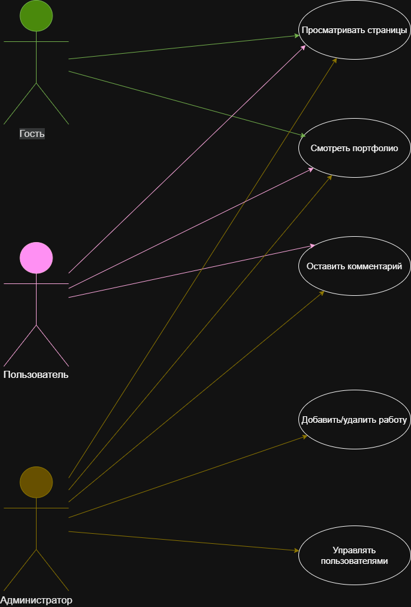

# Сайт-портфолио дизайнера Анны Ивановой

## О проекте
Этот репозиторий создан в рамках учебной практики по специальности 09.02.07 «Информационные системы и программирование».
Здесь хранятся файлы технического задания и диаграммы для сайта-портфолио начинающего дизайнера.

## Содержимое репозитория

## Диаграмма прецедентов (Use Case)
Показывает, кто пользуется сайтом и что они могут делать:

## Диаграмма развёртывания (Deployment)
Показывает техническую архитектуру:

## Техническое задание

📄 [Скачать ТЗ (DOCX)](site_tz.docx)

## Технологии проекта
- **LAMP** (Linux, Apache, MySQL, PHP)
- **WordPress**
- **GitHub**

## Дата
28 апреля 2026 г.

## Выполненные задачи

- Созданы 6 страниц (Главная, Портфолио/Работы, Услуги и цены, Обо мне, Контакты, Отзывы) в соответствии с ТЗ.
- Настроено главное меню с этими страницами (тема Astra).
- Установлен плагин Contact Form 7, форма добавлена на страницу «Контакты» и на главную страницу.
- Написаны 3 статьи-проекта:  
  1. Логотип для кофейни «Кофе и точка»  
  2. Пост для Instagram: бьюти-блог  
  3. Визитка для мастера маникюра  
  Каждая статья содержит изображение, рубрику и текст от 150 слов.
- Настроен дизайн сайта: цвета (черный + малиновый акцент), шрифты, адаптивность.
- Оформлены страницы «Обо мне» и «Отзывы» с использованием блоков.

## Скриншоты

### 1. Главная страница с меню

### 2. Список всех страниц в админке

### 3. Страница «Контакты» с формой обратной связи

### 4. Список трёх статей в разделе «Записи»

## Вывод

За день освоены базовые навыки наполнения сайта на WordPress: создание страниц, настройка меню, добавление контента (статьи, изображения, рубрики), установка плагина формы связи, базовые принципы дизайна. Сайт портфолио готов к демонстрации.

