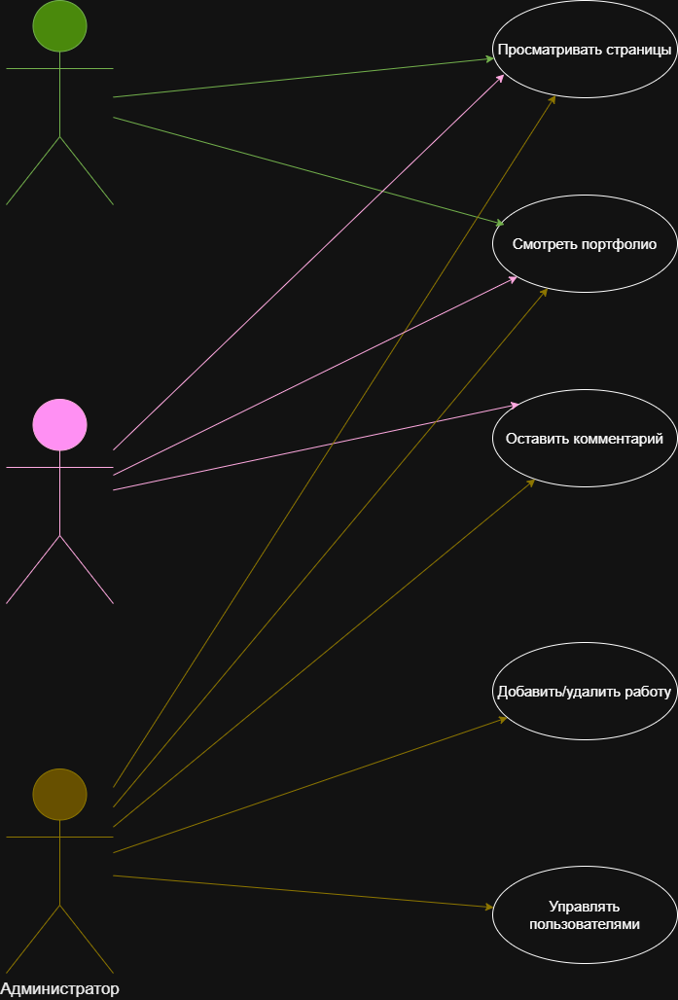

# Сайт-портфолио дизайнера Анны Волковой

## О проекте
Этот репозиторий создан в рамках учебной практики по специальности 09.02.07 «Информационные системы и программирование».
Здесь хранятся файлы технического задания и диаграммы для сайта-портфолио начинающего дизайнера.

## Содержимое репозитория

## Диаграмма прецедентов

