# Сайт-портфолио дизайнера Анны Ивановой

## О проекте
Этот репозиторий создан в рамках учебной практики по специальности 09.02.07 «Информационные системы и программирование».
Здесь хранятся файлы технического задания и диаграммы для сайта-портфолио начинающего дизайнера.

## Содержимое репозитория

## Диаграмма прецедентов (Use Case)
Показывает, кто пользуется сайтом и что они могут делать:

## Диаграмма развёртывания (Deployment)
Показывает техническую архитектуру:

## Техническое задание

📄 [Скачать ТЗ (DOCX)](site_tz.docx)

## Технологии проекта
- **LAMP** (Linux, Apache, MySQL, PHP)
- **WordPress**
- **GitHub**

## Дата
28 апреля 2026 г.

## Выполненные задачи

- Созданы 6 страниц (Главная, Портфолио/Работы, Услуги и цены, Обо мне, Контакты, Отзывы) в соответствии с ТЗ.
- Настроено главное меню с этими страницами (тема Astra).
- Установлен плагин Contact Form 7, форма добавлена на страницу «Контакты» и на главную страницу.
- Написаны 3 статьи-проекта:  
  1. Логотип для кофейни «Кофе и точка»  
  2. Пост для Instagram: бьюти-блог  
  3. Визитка для мастера маникюра  
  Каждая статья содержит изображение, рубрику и текст от 150 слов.
- Настроен дизайн сайта: цвета (черный + малиновый акцент), шрифты, адаптивность.
- Оформлены страницы «Обо мне» и «Отзывы» с использованием блоков.

## Скриншоты

### 1. Главная страница с меню
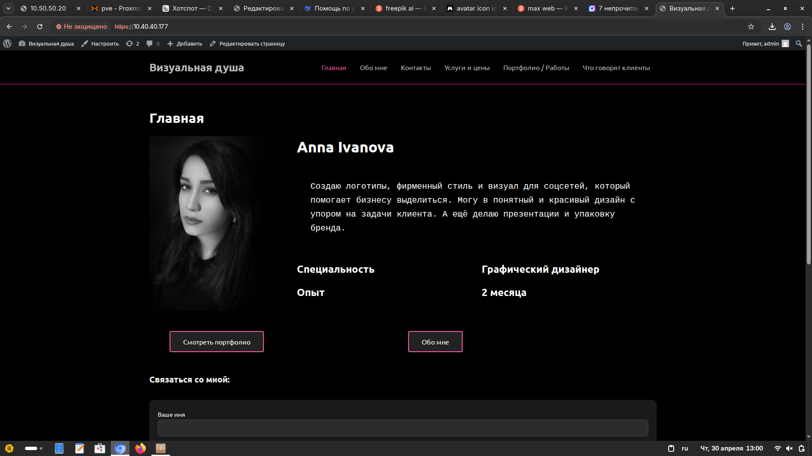

### 2. Список всех страниц в админке
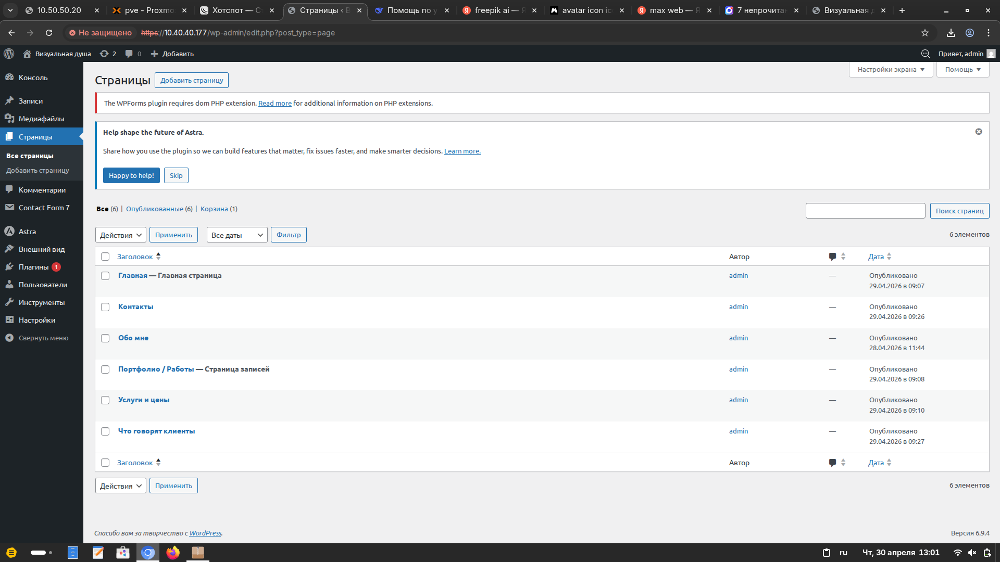

### 3. Страница «Контакты» с формой обратной связи
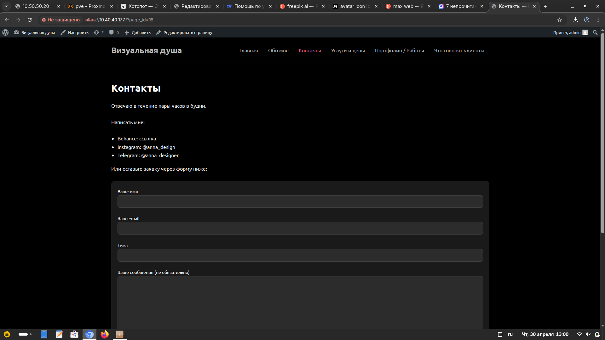

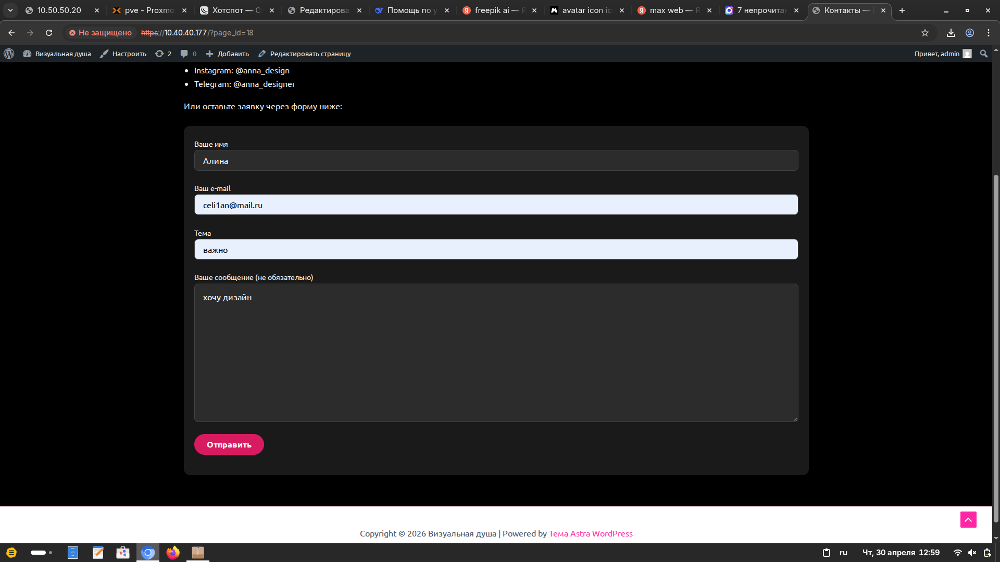

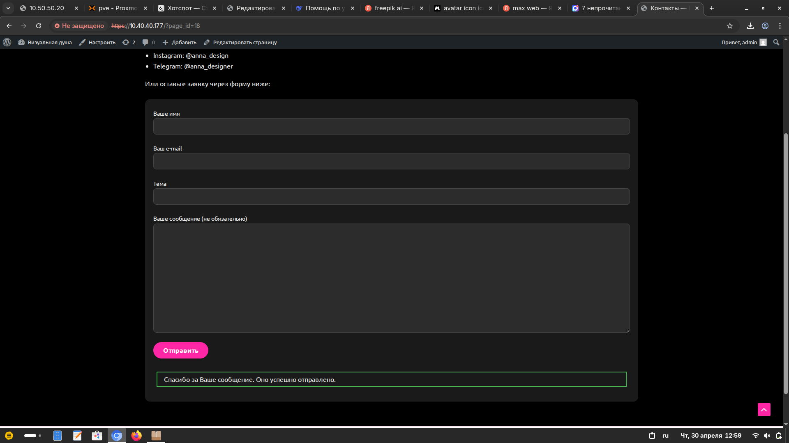

### 4. Список трёх статей в разделе «Записи»
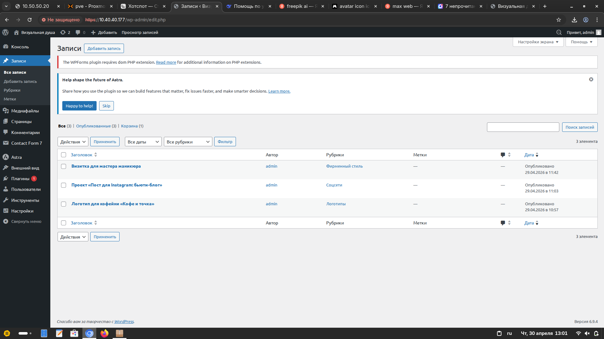

## Вывод

За день освоены базовые навыки наполнения сайта на WordPress: создание страниц, настройка меню, добавление контента (статьи, изображения, рубрики), установка плагина формы связи, базовые принципы дизайна. Сайт портфолио готов к демонстрации.

# День 7

## Что проверила

- Все функции в файле `functions.php` снабжены PHPDoc-блоками (вида `/** ... */`).
- В каждом PHPDoc-блоке есть: краткое описание, тег `@return` с типом и описанием.
- Зарегистрирован шорткод `[приветствие]` – он корректно выводит текущую дату.
- Внутри тела функций присутствуют строчные комментарии (`//`), поясняющие неочевидные моменты.
- Синтаксис PHP не нарушен: точки с запятой, закрывающие фигурные скобки, отсутствие лишних пробелов или пустых строк, которые могли бы сломать код.

## Что нашла

- Все существующие функции уже были задокументированы правильно – их PHPDoc-комментарии соответствуют стандарту.
- Новая функция `privetstvie()` добавлена, для неё написан полный PHPDoc-комментарий (краткое описание, `@return string`).
- Шорткод `[приветствие]` работает на главной странице и показывает строку с сегодняшней датой в нужном формате.
- Внутри новой функции есть строчный комментарий, объясняющий использование `date()` и формата `'d.m.Y'`.
- **Замечаний нет** – код написан аккуратно, документация оформлена по стандарту, всё готово к использованию.

## Работающее приветствие

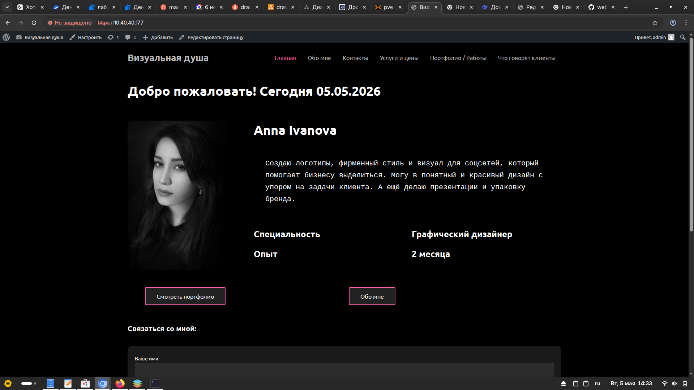

## Что исправила

- Ничего не исправлялось, так как код уже был правильным.
- Единственное действие – добавила функцию `privetstvie()` вместе с её PHPDoc-комментарием.

# День 8. Добавление форума bbPress на сайт портфолио

## Цель
Установить и настроить форум на сайте портфолио дизайнера, создать форумы, темы, сообщения, категории, настроить роли пользователей, добавить правила и протестировать работу.

## Пошаговая инструкция по установке и настройке

### 1. Установка плагина bbPress
- Админка → Плагины → Добавить новый
- Поиск `bbPress`, установить, активировать

### 2. Создание структуры форума (категории и форумы)
Созданы следующие **категории** (тип «Категория»):
- «Общие вопросы»
- «Дизайн-тренды и ресурсы»
- «Обратная связь и отзывы»

Созданы **форумы** (тип «Форум») с указанием родительской категории:
- Тренды и вдохновение
- Обсуждение портфолио Анны
- Вопросы начинающего дизайнера
  
### 3. Создание тем и сообщений
Минимум 1 форум – Да  
Минимум 3 темы – Да  
Минимум 3 сообщения – Да

**Сообщения (ответы):**  
Добавлены ответы на каждую тему. Всего сообщений – 31.

### 4. Отображение форума на сайте
- Создана страница «Обсуждения» со шорткодом `[bbp-forum-index]`
- Страница добавлена в главное меню сайта

### 5. Правила форума
- Правила размещены непосредственно в форуме
- Текст правил:
- Создавайте тему в том разделе, к которому она относится по смыслу. Название темы должно быть конкретным и понятным . Описывайте вопрос подробно — это поможет получить быстрый и точный ответ. Запрещены оскорбления, спам и реклама. Перед созданием темы воспользуйтесь поиском — возможно, ваш вопрос уже обсуждался.
- Старайтесь отвечать по существу вопроса, без «флуда». Не поднимайте старые темы без веской причины (не «некропостинг»). Если вы не уверены в своём ответе, лучше промолчать или подождать других. Уважайте авторов тем и других отвечающих.

### 6. Внешний вид
- Для изменения цветовой схемы форума использован плагин «bbP Style Pack»
- Результат: фон форума тёмный, текст белый, ссылки акцентные

# Отчёт о тестировании форума bbPress

## Функциональные тесты

- [x] Плагин bbPress установлен и активирован
- [x] Создана страница «Форум» со шорткодом `[bbp-forum-index]`
- [x] Созданы категории и форумы
- [x] Создано не менее 3 тем
- [x] Создано не менее 3 сообщений
- [x] Форум добавлен в главное меню
- [x] Страница форума открывается без ошибок
- [x] Создание новой темы через интерфейс работает
- [x] Отправка сообщения работает
- [X] Добавлены правила форума
- [X] Изменен внешний вид форумов
- [X] Добавлена роль "Подписчик"

## Настройки безопасности и прав

- [x] Роль по умолчанию для новых пользователей – «Участник»
- [x] Правила форума созданы и доступны из меню

## Внешний вид

- [x] Цветовая схема форума приведена к тёмной (фон #111, текст белый)
- [x] Цвет ссылок меню – светло-серый, при наведении малиновый

## Замечания
Не обнаружено.

## Итог
Форум готов к использованию. Все критерии выполнены.
## Скриншоты

## Плагин bbPress в списке установленных
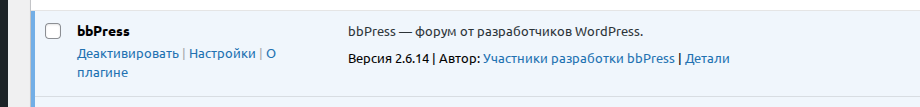
   
## Список форумов и категорий в админке
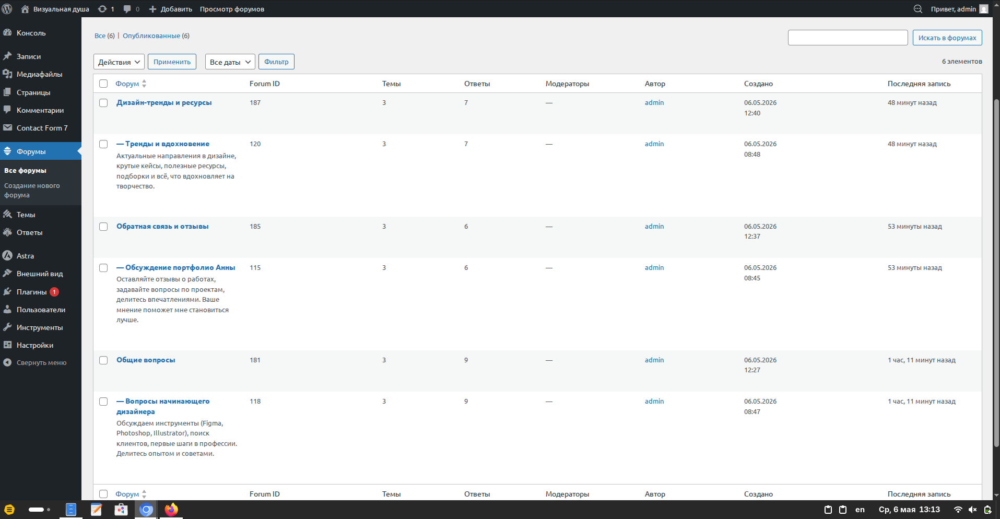   

## Главная страница форума с темами
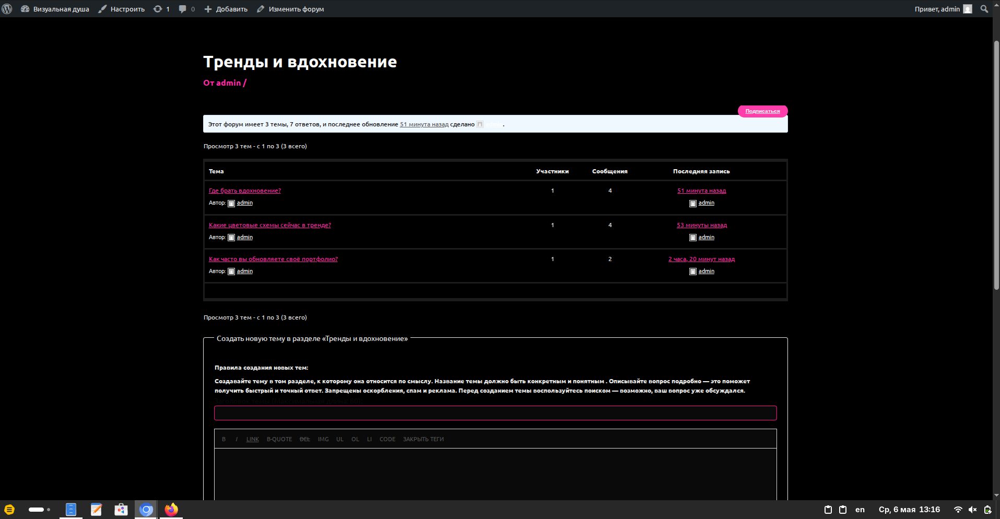 

## Пункт «Обсуждения» в главном меню
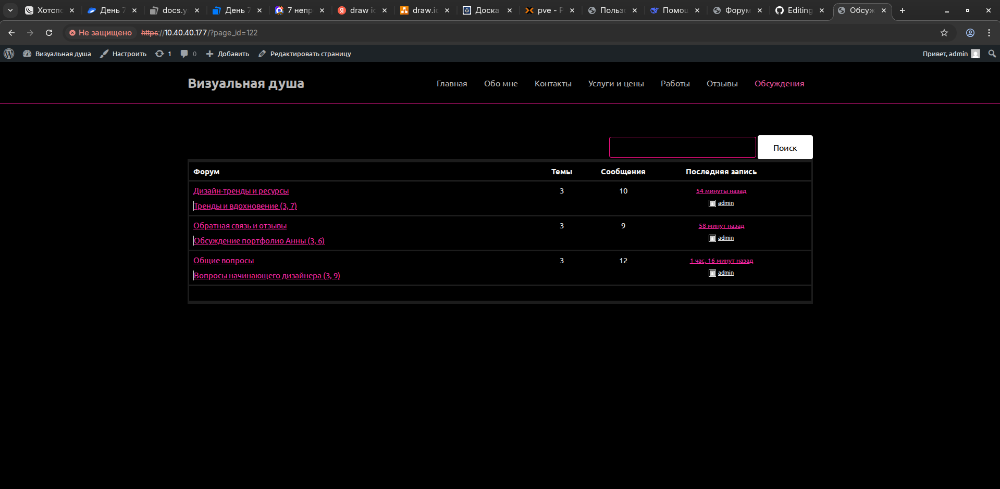 

## Правила форума
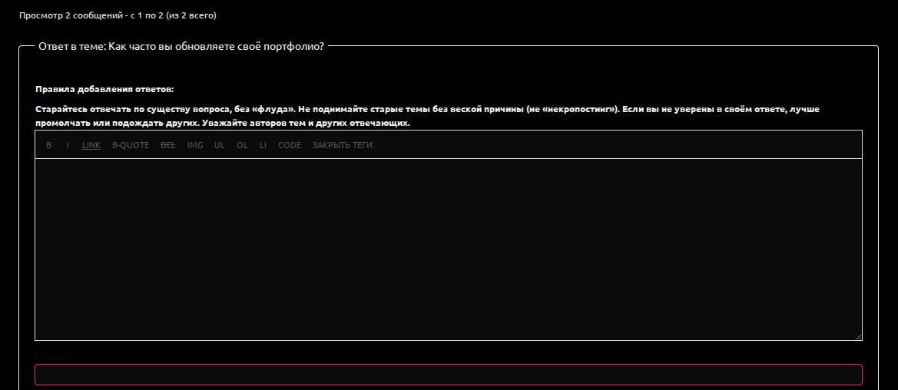 

## Пример созданной темы и ответа
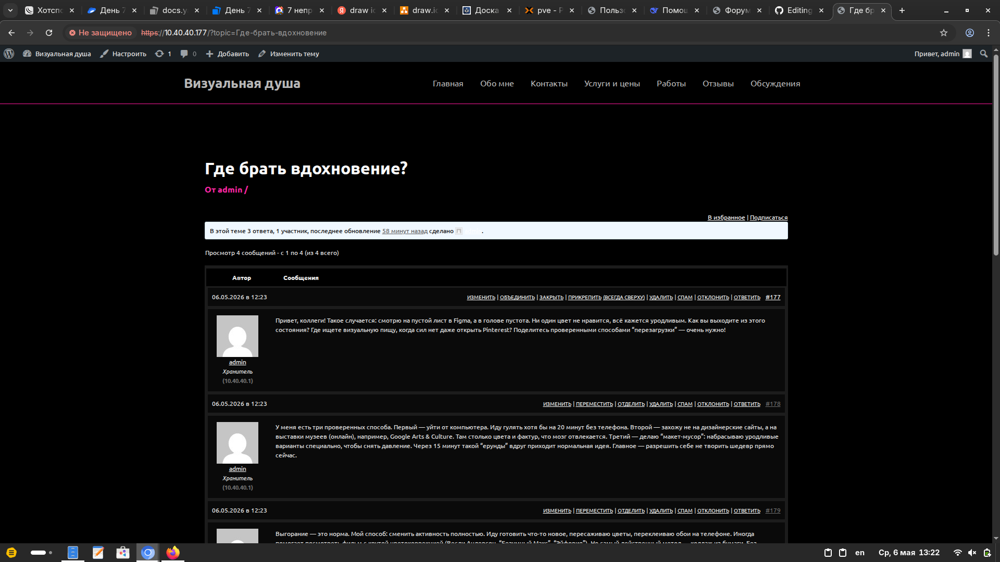 

## Вывод
Форум полностью функционален, соответствует критериям задания, интегрирован в сайт портфолио, прошёл успешное тестирование. Дополнительные задания выполнены.
